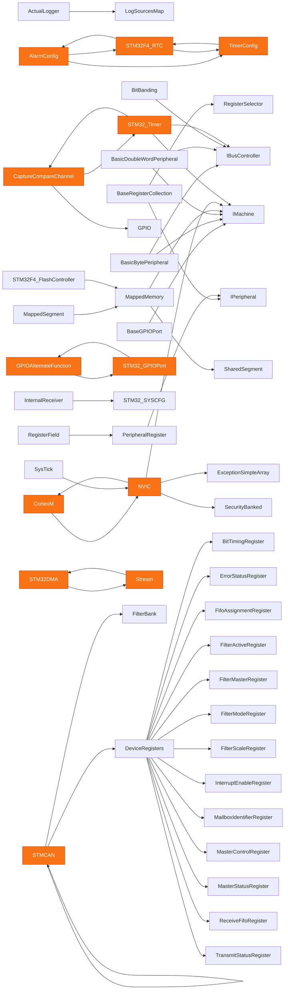

# State of the transpiler

Narrative counterpart to the generated `STATUS.md`. Every number is produced by
a committed script. Where something is unverified it says so.

## What it is

A C#-to-Rust transpiler driven by a corpus database. Renode is the corpus that
tells us which constructs matter — not the deliverable.

    frontend/RenodeIngest/     Roslyn walk -> SQLite corpus
    rulesdb/rules/*.json       the knowledge, as DATA
    scripts/emitter/lang/      generic C#, corpus-agnostic
    scripts/emitter/plugins/   corpus idioms, consulted FIRST
    src/csharp-rt/             types C# has and Rust lacks

`check_layering.py` fails the commit if the generic layer names a corpus
construct.

## Proven

**Generated UART replays 33,164 recorded accesses with zero divergences** —
indistinguishable from the hand-written file on the largest oracle available.

| trace | accesses | divergences | |
|---|---|---|---|
| usart1 | 33,164 | 0 | **100%** |
| exti | 25 | 0 | **100%** |
| adc1 | 16,800 | 1,192 | 89.6% |
| syscfg | 9 | 2 | 66.7% |
| gpioPortA | 62 | 14 | 17.6% |
| can1 | 228 | 99 | 13.9% |
| dma1 | 183 | 88 | 9.3% |
| dma2 | 12,356 | 6,164 | 0.2% |

Low rows are low for **named** reasons: DMA needs sub-peripheral composition
(#55), GPIO needs peer-call type resolution (#54).

**Rules generalise.** Built against two peripherals, the converter emits **470
of 569 modules across all of Renode** that compile. Cut and whole-tree gap
distributions agree to **2.0 percentage points**. Rules mined from a
Python-to-Rust project transferred unchanged.

## Not proven

- **Compiling is not working.** c2rust emits >99.99% and 72.64% runs. 470
  modules compile; **8 have ever been executed**.
- **Replay proves indistinguishability on that trace only.** The invented
  `.with_reserved(9, 23)` survived 33,000 accesses.
- **Threading cannot currently be certified** (#52). Replay is single-threaded
  by construction.
- **No dynamic evidence.** `ownership.tsv` is static — declared types and
  access counts.

## The three checks

| check | proves | blind to |
|---|---|---|
| `check_generated` | reproducible from rules alone | whether the rules are right |
| `compile_check` | well-formed | whether it behaves |
| trace replay | matches recorded C# | anything the trace misses |

Each found bugs the others could not. `x as i32 << 8` (400 errors, one
construct) came from compiling. `out arr[i]` binding to nothing — which
compiled, was reproducible, and produced no gap — came from replay.

## The object graph

552 fields in the cut: 243 values, 94 arena handles, 73 callbacks, 47 shared,
19 back-references — **52 edges, 7 cycles**. Cycle participants in orange.

Generated by `scripts/prescan.py`; `ownership-cut.tsv` carries the per-field
classification with its evidence.

Across the whole tree: **1,278 edges, 63+ cycles, 1,690 reference fields.**

That difference is why the GC question is scope-dependent, and why #57 takes it
head-on: `Gc<T>` to make the port mechanical, a tracer to remove it again. The
tracer doubles as the dynamic evidence this project has never had.

## Progress

Generated lines against reported gaps, per commit. Both lines, deliberately:
generated output FELL from 545 to 523 when withholding-on-gap-markers landed,
and that was an improvement — methods carrying a `/* GAP */` marker stopped
being emitted, one of which was an infinite loop that compiled. A single
"progress" number would have shown that as a regression.

Regenerate with `scripts/progress_graph.py` (writes `tmp/progress.html`).

## What bit us

**Six paths produced no output and reported no reason** — indistinguishable
from a rule correctly declining, so review could not catch them. Two were
reported as landed before anyone noticed. Four came from editing by string
match against anchors moved by a refactor.

**Four bugs compiled cleanly and were wrong**: a self-call recursing forever, a
`/* GAP */` in a loop increment, an unmapped return type falling back to
`-> ()`, and `16.0` emitted as `16`.

The remedy was tooling, not discipline — `must_explain`, the wiring guard, the
ratchets. Each found something the day it landed.

## Open

| # | what | decided |
|---|---|---|
| #57 | `Gc<T>` + tracer | **yes** — supersedes D1 if it lands |
| #56 | inheritance | **re-decide**, including embed-vs-merge |
| #41 | `IMachine` trait | **full trait**; map the 45 blocked types first |
| #52 | threading | **oracle first**, then settle D3 |
| #54 | peer-call type attribution | GPIO's blocker |
| #55 | sub-peripheral composition | DMA, 12,539 accesses |
| #53 | instrumentation tail | five paths unaudited |
| #58 | C#/Rust semantics, measured | finalizers are a non-issue (0); `ref` params (40) unhandled |
| #59 | concepts from research never made into work | WASM oracle, feature reduction, repair loop |

**Still hand-written: 445 lines.** `uart.rs` and `gpio_port.rs`. Whole-peripheral
emission is what "zero patches" means, and it makes every decision above
load-bearing at once.
